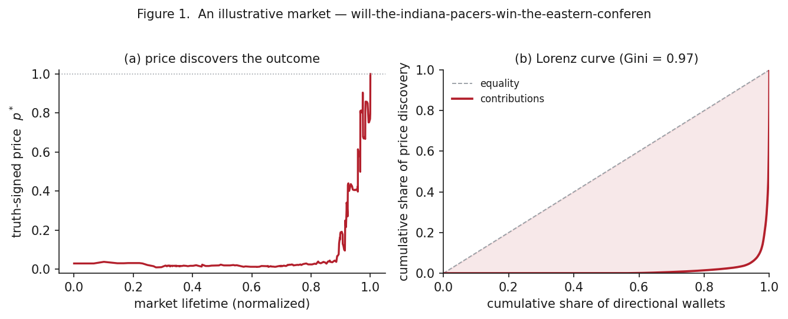
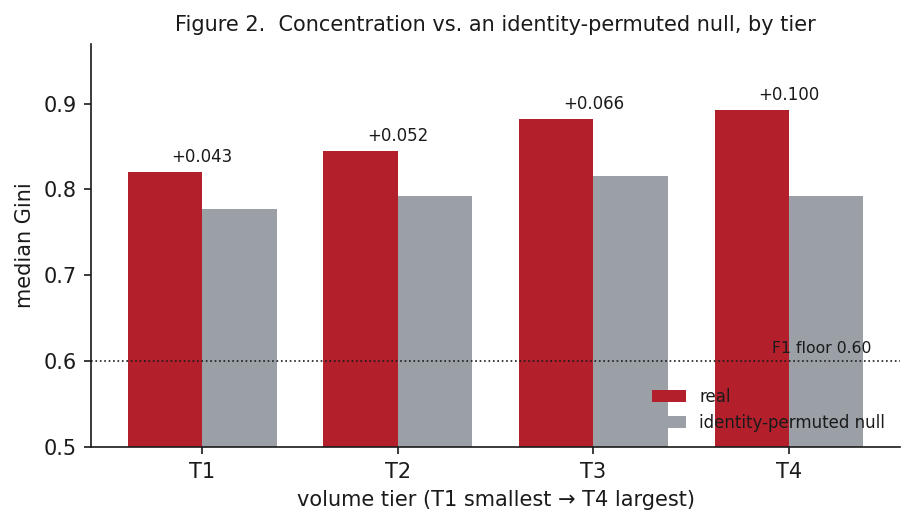
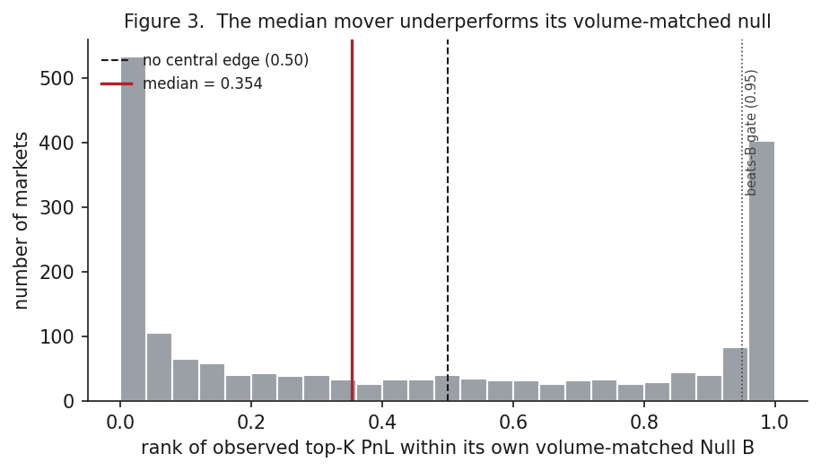
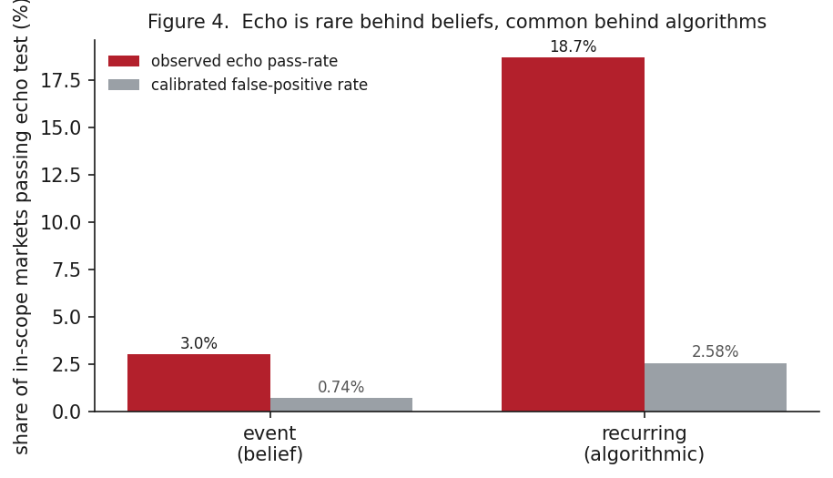

# Who Moves the Price? Price-Impact Concentration and the Limits of "Smart Money" in Prediction Markets

*Working draft — strictly academic register. Every quantitative claim traces to a committed
`data/out/*.json` artifact (see Appendix D); figures are generated deterministically by
`pipeline/make_figures.py`.*

---

## Abstract

Prediction markets are commonly described as machines for aggregating dispersed information — the
"wisdom of crowds." We test a contrary hypothesis: that the price is set by the net directional
position of a small number of large, aggressive traders, while most participants supply liquidity or
follow. Using the complete on-chain trade history of 2,695 resolved Polymarket V1 markets, and
recovering the true order *aggressor* from settlement events (information the public trade feed does
not expose), we pre-register three falsification tests and then attack our own results with
identity-permutation and volume-matched nulls. We find a concentrated but bounded picture. (i)
Price-discovery impact is highly concentrated — in the median market roughly five wallets account for
half of all truth-ward price movement — and this concentration significantly exceeds an
activity-matched null in 87% of markets, with the genuine excess growing monotonically with market
size. However, the absolute level is partly mechanical, it tracks capital concentration, and our
pre-registered Gini threshold proved non-discriminating. (ii) The largest directional traders are
*not* collectively "smart money": a statistically clear minority beat a volume-matched null far more
than chance, but the median large trader underperforms that null — conviction is high-variance and
mostly unrewarded. (iii) Small wallets do trade in the direction of large wallets shortly afterward,
but this echo is rare behind one-off belief markets (3% of markets) and common behind recurring
algorithmic markets (19%); we make no causal claim. We report negative and method-dependent results
with equal prominence. The contribution is as much methodological — on-chain aggressor recovery and
the adversarial nulls that most microstructure studies omit — as substantive.

---

## 1. Introduction

A standard defense of prediction markets is that they aggregate the private information of many
independent participants into a single price that is hard to beat. The mechanism is the crowd: many
small, diverse bets average out idiosyncratic error. An opposing folk view, common among
practitioners, holds that the price is really set by a handful of large, opinionated wallets — that
the "market" is a few whales and a lot of echo.

These two pictures make different, testable predictions about *who moves the price*, and prediction
markets are an unusually clean setting in which to adjudicate them. On a public blockchain every
trade is observable at the level of an individual wallet, and — unlike equities or sports books —
each market *resolves* to a known outcome, providing ground truth against which to score both price
movement and trader skill. Polymarket's V1 venue, settled in USDC.e on Polygon, offers thousands of
such markets across politics, sports, crypto, and current events.

We make three contributions. First, **methodological**: the public trade endpoint reports trade
*direction* but not order *role*, so it cannot say which counterparty was the aggressor who consumed
liquidity and moved the price. We recover the aggressor on-chain from exchange settlement events,
which is what makes impact attribution possible at all. Second, **empirical**: we pre-register three
falsification criteria — concentration, mover skill, and crowd echo — before touching the data, run
them across a stratified corpus of 2,695 resolved markets, and report the population-level results.
Third, and most important for credibility, **adversarial**: we then try to break our own two
load-bearing results with nulls designed to expose mechanical or size-driven artifacts. Two of the
three claims weaken materially under this scrutiny, and we report them at the reduced strength the
evidence supports.

The resulting picture is concentrated but not omniscient. A few wallets genuinely do move price more
than chance, especially in large markets — but the concentration is partly mechanical and mirrors
capital; the large traders are high-variance with only a skilled minority; and the crowd echoes
mainly in algorithmic markets. "Smart money" is real, but far narrower than the folk story claims.

---

## 2. Setting and Data

**Venue.** We study Polymarket V1: binary, resolved markets traded on the V1 CTF Exchange
(`0x4bFb…982e`) and NegRisk Exchange (`0xC5d5…f80a`), settled in USDC.e (6 decimals). The corpus is
bounded below by the order-book era (`enableOrderBook = true`, excluding the 2020-era AMM markets)
and above by the ~April-2026 V1→V2/pUSD migration, enforced operationally by excluding any market
with on-chain V2 activity. V2 is deferred to a separate, independently verified replication.

**Corpus.** From a Gamma-API enumeration we draw a stratified, seed-frozen sample across four volume
tiers (T1 \$25k–100k, T2 \$100k–1M, T3 \$1M–10M, T4 >\$10M) and two market types defined by a
pre-registered classifier: *event* markets (a belief about one notable outcome — the headline corpus)
and *recurring* markets (high-frequency algorithmic streams of many low-stakes outcomes — a contrast
group, never pooled into the headline). A pre-registered analyzability floor requires ≥30 non-market-
maker directional wallets. The processed sample is 2,755 markets; **2,695 are analyzable (1,912 event,
783 recurring), 49 fall below the floor ("thin"), and 11 are excluded** (Table 1).

**The aggressor problem (methodological pivot).** The Data-API `/trades` endpoint exposes 19 fields
including `side` (buy/sell) but *no maker/taker role* — it cannot identify the aggressor. Native role
lives on-chain: each fill emits `OrderFilled`, and the matched orders emit `OrdersMatched`, whose
`takerOrderMaker` is the real aggressor (the per-leg `OrderFilled.maker`s are the resting liquidity
providers). We join trades to settlement by transaction hash to recover, for every fill, who consumed
liquidity. This join is the foundation of all attribution below; without it, "who moved the price"
is unanswerable from public data.

**De-truncation and coverage.** The public feed hard-caps at 4,000 rows per (market, side), returned
most-recent-first, so high-volume markets return truncated *and* time-biased tapes (recovering only a
market's closing activity). We recover complete tapes from the Goldsky order-book subgraph, which
indexes the full V1 era with uncapped cursor pagination, and validate the recovered tapes fill-for-
fill against both the untruncated public feed and independent on-chain `getLogs` before trusting them
(Appendix B). **1,325 of the 2,695 analyzable markets required de-truncation.** Eleven of the largest
markets (the 2024 U.S. election monsters and other multi-hundred-thousand-fill markets) exceed the
free-tier recovery ceiling and are excluded as an honestly quantified **coverage gap of 15.1% of
corpus volume**; all headline results are reported on the measurable 84.9%.

**Table 1. Corpus composition (analyzable markets, by tier and type).**

| Tier | Volume range | Event | Recurring | Total |
|:-----|:-------------|------:|----------:|------:|
| T1   | \$25k–100k   |   467 |       241 |   708 |
| T2   | \$100k–1M    |   495 |       248 |   743 |
| T3   | \$1M–10M     |   500 |       250 |   750 |
| T4   | >\$10M       |   450 |        44 |   494 |
| **Total** |          | **1,912** | **783** | **2,695** |

*Excluded as beyond free-tier recovery: 11 giant markets (15.1% of corpus volume). Below the
≥30-directional-wallet analyzability floor ("thin"): 49. Required subgraph de-truncation to obtain a
complete tape: 1,325 of the 2,695.*

---

## 3. Method

**Canonical frame.** We collapse each market to "token-0" (Yes) space, with price `p ∈ [0,1]` and
resolution `R ∈ {0,1}`. We define the **truth-signed price** `p* = p` if `R=1` else `1−p`, so that
*any* increase in `p*` is convergence toward the realized outcome. A fill's signed direction `d` and
truth-signed direction `d* = d` if `R=1` else `−d` follow. This eliminates a class of sign errors and
lets us speak of "price discovery" as movement toward truth.

**Market-maker filter.** Price formation is plumbing plus information; we remove the plumbing. A two-
signal classifier flags a wallet as a market maker if (A) its inventory is *flat* (|net|/gross below a
threshold, above a notional floor) and (B) it is *broad* (active in many markets, tiny share here).
Removing market makers can only *lower* measured concentration, so the filter is conservative for our
headline claim. On a stratified subset we validate the two-signal filter against a three-signal
classifier that adds native on-chain role, and accept it where the two agree on the downstream
concentration verdict (Appendix A, amendment A4).

**Attribution (interval net-flow).** In a continuous order book, price moves with *net directional
pressure*; arbitrageurs and market makers round-trip within short windows, so their gross
participation is large but their net flow is ≈0. We therefore group fills into blocks of `N = 25`
consecutive fills and split each block's truth-signed price change among the non-market-maker
aggressors whose net flow pushed in the move's direction, pro-rata by net flow. A flat bot's buys and
sells cancel within a block and absorb ≈no credit. Each wallet's contribution `C_w` is the sum of its
block credits; wrong-way pushes are naturally negative. We report this primary alongside a per-fill
attribution as a robustness companion (§5).

**Three pre-registered tests.** Before any market was analyzed we froze (in `CORPUS_PREREG.md`, git-
timestamped 2026-06-07) three falsification criteria:

- **F1 — concentration.** The Gini coefficient and `N_half / n_directional` over positive
  contributors. Corpus-falsified if the median Gini < 0.60 or median `N_half/n` > 0.05.
- **F2 — mover skill.** Select the top-`K` movers resolution-blind by net directional size; score
  hold-to-resolution PnL against **Null B** (volume-matched random wallets — the "smart vs. rich"
  test) at the 95th percentile (B = 10,000 resamples). The corpus statistic is the fraction of
  markets in which movers beat Null B, against a 5%-by-construction baseline.
- **F3 — echo.** Lagged cross-correlation of big-wallet vs. small-wallet net flow; a market shows echo
  if the positive-lag peak ρ ≥ 0.15, exceeds its own circular-shift null band, and beats every non-
  positive lag. The corpus statistic is the in-scope fraction passing, benchmarked against a
  *calibrated* per-market false-positive rate (not a flat 5%; see §4.3).

**Figure 1.** An illustrative market (Indiana Pacers to win the Eastern Conference). (a) The
truth-signed price $p^*$ sits near zero for most of the market's life and snaps to the outcome late —
price discovery is concentrated in time. (b) The Lorenz curve of wallet contributions hugs the corner
(Gini 0.97): a handful of wallets account for essentially all of the price discovery.

---

## 4. Results

### 4.1 Concentration is real, but partly mechanical and capital-tracking

In the median event market the concentration of price-discovery impact is high: the interval-method
**Gini is 0.866** (IQR 0.812–0.904), and the fewest wallets reaching half of all truth-ward movement
is **`N_half` = 5** — roughly 0.9% of the directional traders in a market. By the pre-registered F1
criterion (median Gini ≥ 0.60, median `N_half/n` ≤ 0.05), concentration is not falsified.

This raw comparison, however, is too generous, for two reasons we report plainly. First, the result is
method-dependent: under per-fill attribution the median Gini falls to **0.700**, and the two methods
disagree on the per-market F1 verdict in **29%** of markets. We adopt interval attribution as the
principled primary (it nets out bot round-tripping, §3), but a reader should know the headline
magnitude depends on this choice. Second, and more seriously, **the 0.60 threshold does not
discriminate.** To test whether high Gini reflects the thesis (specific wallets persistently moving
price) or merely the mechanics of heavy-tailed trading, we permute wallet identity across fills —
preserving the price path, fill sizes, per-wallet fill counts, the market-maker set, and the
attribution method — and recompute concentration. **The identity-permuted null itself has a median
Gini of 0.800, and clears the 0.60 floor in 95.9% of markets.** Passing 0.60 was therefore nearly
guaranteed by trade structure alone; our pre-registered bar sat below the mechanical baseline.

The correct test is real concentration *against this null*, and here the thesis survives in a bounded
form. Real Gini exceeds the permuted null in **87.4% of markets**, and the excess grows monotonically
with market size: the median real-minus-permuted gap rises from **+0.043 in T1 to +0.100 in T4**
(Figure 2). Identity-driven concentration — specific wallets aligning net direction with price moves
beyond what their activity alone implies — is thus genuine and strongest in the largest, most liquid
markets, precisely where the question matters most. We also note that impact concentration roughly
tracks capital: the Gini of gross notional (0.890) slightly exceeds the impact Gini (0.866), so
"setting the price" largely coincides with "trading the most," rather than exceeding it.

The honest statement of F1 is therefore: *price-discovery impact is highly concentrated and
significantly more concentrated than an activity-matched null — with the genuine excess concentrated
in large markets — but the absolute level is partly mechanical, it tracks capital, and the pre-
registered Gini floor was uninformative.*

**Figure 2.** Median real (red) vs. identity-permuted (grey) Gini, by volume tier. The permuted null
clears the pre-registered 0.60 floor at every tier — so 0.60 does not discriminate — yet real
concentration exceeds the null at every tier, and the excess (annotated) grows monotonically from
+0.043 (T1) to +0.100 (T4).

### 4.2 The movers are a skilled minority, not "smart money"

Selecting the top `K = 10` movers resolution-blind by net directional size, the fraction of markets in
which they beat the volume-matched Null B at its 95th percentile is **22.8%** (436 of 1,912), against a
5%-by-construction baseline — a binomial p ≈ 1.3 × 10⁻¹⁵⁶. The effect is robust across K (27.1% / 22.8%
/ 17.3% at K = 5 / 10 / 20), diluting with breadth but remaining overwhelmingly significant. By the
pre-registered F2 criterion, movers "beat the rich null above chance."

But the kill criterion tests only the upper tail, and the upper tail can be produced by a skilled
minority sitting atop a high-variance, zero- or negative-edge majority. Two pre-registered companions
show this is what is happening. First, the symmetric lower tail: top movers *underperform* Null B's
5th percentile in **29.7%** of markets — a larger fraction than beat its 95th. Second, and decisively,
the **center**: the observed top-K PnL ranks at only the **35th percentile** of its own volume-matched
null (median rank 0.354), and beats the null's *mean* in just **43.9%** of markets — significantly
*below* one half. The typical large directional trader does *worse* than a random portfolio of equal-
volume wallets (Figure 3).

The honest statement of F2 is therefore: *a statistically clear minority of the largest directional
traders possess genuine skill that exceeds their size, but the median such trader underperforms a
volume-matched null. Being a large mover signals conviction, which is high-variance and mostly
unrewarded — not membership in a uniformly informed "smart money."*

**Figure 3.** Where each market's top-K movers rank within their own volume-matched Null B. The
distribution is strongly bimodal — a large mass at the bottom (movers worse than nearly all
volume-matched draws) and another near the top (the skilled minority that clears the 0.95 beats-B
gate) — with the median at 0.354, below the 0.50 no-central-edge line. The lower mass exceeds the
upper: large movers are high-variance and, at the center, underperform their volume class.

### 4.3 Echo is rare behind beliefs, common behind algorithms

We measure echo as a positive-lag peak in the cross-correlation of big-wallet and small-wallet net
flow that clears both a magnitude gate (ρ ≥ 0.15) and the market's own circular-shift null band, and
beats every non-positive lag. A flat-5% benchmark would be wrong here: because the magnitude gate makes
the joint test stricter than the band alone, a no-echo market clears it by chance *less* than 5% of the
time, so benchmarking against 5% biases toward declaring "no echo." We pre-registered the correct
benchmark — each market's own combined false-positive rate, estimated from its circular-shift null and
averaged across the in-scope sample. (We flag this explicitly because the calibrated baseline was fixed
in the frozen pre-registration, before analysis, not chosen after a flat-5% test failed.)

Among 1,909 in-scope event markets, **3.04%** (58) pass the echo test, against a calibrated mean false-
positive rate of **0.74%** — a Poisson-binomial p ≈ 8.7 × 10⁻²⁰. Echo is thus statistically real in
event markets but *rare*. The contrast with recurring markets is sharp: **18.7%** of 561 in-scope
recurring markets pass, against a calibrated FPR of 2.58% (p ≈ 2.5 × 10⁻⁵⁹) — roughly seven times the
chance rate (Figure 4). Echo is overwhelmingly an algorithmic-stream phenomenon: small wallets follow
large ones far more in high-frequency recurring markets than behind one-off beliefs. We make **no
causal claim**; association at a lag is consistent with following, with common response to a shared
signal, or with shared wallet identity, and a price-chasing confound probe is reported alongside.

**Figure 4.** Share of in-scope markets passing the echo test (red) against the calibrated mean
false-positive rate (grey), for event and recurring markets. Both exceed their calibrated nulls, but
recurring (algorithmic) echo (18.7% vs. 2.58%) dwarfs event (belief) echo (3.0% vs. 0.74%).

### 4.4 Type vs. volume: a within-tier contrast

Pooled, event markets are more concentrated than recurring ones (median Gini 0.866 vs. 0.831), but this
confounds type with volume, since the event sample skews to larger markets. Holding volume fixed within
each tier, event markets remain more concentrated than recurring in every tier (Δ Gini +0.037 / +0.041
/ +0.011 / +0.012 across T1–T4; Mann–Whitney significant in T1–T3, underpowered in T4). Two facts follow.
Concentration is **universal** — recurring markets also score Gini 0.78–0.88, far above any floor, so the
finding is not an artifact of selecting belief markets. And belief markets concentrate *modestly* more
than algorithmic ones, with the gap shrinking as markets grow: at the top, type ceases to matter and
the largest markets are concentrated regardless.

**Table 2. Corpus statistics, event (headline) vs. recurring (contrast).**

| Statistic | Event | Recurring |
|:----------|------:|----------:|
| **F1** median Gini (interval) | 0.866 | 0.831 |
| **F1** median `N_half / n` | 0.0092 | 0.0146 |
| **F1** real Gini > permuted null (share of markets) | 87.4% | 87.9% |
| **F2** top-10 beat Null B (95th pct) | 22.8% | 16.0% |
| **F2** top-10 *underperform* Null B (5th pct) | 29.7% | 21.6% |
| **F2** median rank of observed top-K within Null B | 0.354 | 0.370 |
| **F3** in-scope markets passing echo test | 3.04% | 18.7% |
| **F3** calibrated mean false-positive rate | 0.74% | 2.58% |

*All F2/F3 corpus fractions exceed their respective chance baselines at p < 10⁻¹⁹ (binomial /
Poisson-binomial), except the F2 median rank, which is significantly **below** 0.5 — the central
result of §4.2.*

---

## 5. Robustness and Threats to Validity

**Robustness riders (F1).** The concentration result is invariant to the analyst's free choices: the
median Gini stays well above any floor at every market-maker flatness band {0.10, 0.15, 0.20}, every
interval window N {10, 25, 50, 100} (median Gini 0.822 / 0.866 / 0.884 / 0.894), and every phase offset
of the window grid; the per-market F1 verdict is invariant across all riders in 90.7% of markets
(Table 3). The window-length gradient also shows our primary N = 25 is mid-range, not chosen to inflate
the result.

**Method dependence.** As noted, interval and per-fill attribution disagree on the per-market F1 verdict
in 29% of markets, and the per-fill median Gini (0.700) is markedly lower. We lead with interval on a
principled basis but report both.

**Coverage gap.** The 11 excluded giant markets are 15.1% of corpus volume and include the highest-
profile markets in the sample (the 2024 U.S. election). We cannot measure them on free infrastructure;
the within-tier contrast (§4.4) shows the largest *measurable* markets remain concentrated, so we expect
the giants to behave similarly, but this is extrapolation.

**Identity, not persons.** Concentration is computed per `proxyWallet`. One person may run several
proxies (a known 2024 election trader ran four), so clustering proxies could only *raise* measured
concentration; the per-proxy headline is conservative. Funding-based clustering is deferred.

**Causality.** F3 is strictly associational; we do not claim the crowd echoes *because* of the whales.

**Table 3. F1 robustness riders (event corpus, interval method).** Median Gini at each setting and the
share of markets whose per-market F1 verdict is invariant across the sweep.

| Sweep | Settings → median Gini | Verdict invariant |
|:------|:-----------------------|------------------:|
| MM flatness band | 0.10 → 0.866 · 0.15 → 0.866 · 0.20 → 0.866 | 99.9% |
| Window length `N` | 10 → 0.822 · 25 → 0.866 · 50 → 0.884 · 100 → 0.894 | 92.9% |
| Phase offset | 0 → 0.866 · 6 → 0.867 · 12 → 0.867 · 18 → 0.865 | 93.7% |

*Median Gini clears any plausible floor at every setting; the per-market F1 verdict is invariant across
**all** riders simultaneously in 90.7% of markets, and passes at all three flatness bands in 95.8%.*

---

## 6. Discussion and Conclusion

The data support a deflated version of the "few whales" thesis. Price-discovery impact in resolved
prediction markets is genuinely concentrated beyond chance, and most so in the large markets that carry
the most money and attention — but the concentration is partly a mechanical property of heavy-tailed
trading, it largely mirrors capital concentration, and our pre-registered inequality threshold did not
discriminate. The largest directional traders are not a uniformly informed "smart money": a minority
have real, size-adjusted skill, but the typical mover is a high-variance, under-rewarded conviction
bettor. And the "echo" of the crowd, while real, is concentrated in algorithmic markets rather than in
the one-off belief markets where the wisdom-of-crowds story is usually told.

For the wisdom-of-crowds debate, the implication is neither vindication nor refutation. Prices are not
the diffuse average of many independent minds — a small set of large traders dominates the impact — but
those traders are not collectively wiser than their capital, so the resulting price is better described
as *capital-weighted conviction* than as either crowd wisdom or smart money. That conviction is right
often enough, in a skilled minority, to make the market informative; it is wrong often enough, in the
majority, to caution against treating large traders as oracles.

The study's limits define its replication agenda: the free-infrastructure coverage gap at the top of
the volume distribution; the deferred proxy-to-person clustering; and a clean V2/pUSD post-migration
replication, whose contracts and decimals we re-verify before use. Most of all, we regard the
adversarial nulls — identity permutation for concentration, volume-matching and mean-edge for skill —
as the methodological core: they are cheap, they are what separated the genuine from the mechanical in
our own results, and we recommend them as standard for any claim that "a few accounts move the market."

All results are deterministic and reproducible from cached raw data; the pipeline, the frozen pre-
registration, and the per-market artifacts are released in full.

---

## Appendix A. Pre-registration and amendments

The falsification criteria F1/F2/F3, the canonical frame, the market-maker filter, the null definitions,
and all reporting commitments were frozen in `FALSIFICATION.md` (single-market) and `CORPUS_PREREG.md`
(corpus), both git-timestamped before analysis. Method changes since are recorded as numbered, dated
amendments rather than silent edits: A1 (scope/role-at-scale/negRisk/floor revisions at discovery), A2
(taxonomy, tiers, sampling, audit protocol), A3 (post-audit classifier revision: belief-ladders are
event-then-deduplicated, bare per-game outcomes are recurring), A4 (the two-vs-three-signal validation
gate), A5 (de-truncation via the order-book subgraph, completeness-gated), A6 (a relative completeness
tolerance for a verified indexer over-count, invariant across a >1000× epsilon band), and A7 (dropping a
split-confounded aggressor-count gate after confirming the public feed over-reports position splits).
The amendment trail is the methodological audit log.

## Appendix B. De-truncation validation

Recovered tapes are trusted only after two bars pass: (1) mapped subgraph fills match the untruncated
public feed exactly on both exchange paths (CTF 2,716/2,716; NegRisk 6,946/6,946), and (2) on independent
on-chain `getLogs` the recovered aggressor tape matches beyond the public ceiling (7,382/7,382 including
2,435 beyond-ceiling fills; raw legs 17,252/17,252). Completeness is gated against the subgraph's own
indexer aggregate. We additionally document the free-tier recovery engineering (adaptive timestamp-window
bisection; an index-asymmetry fix recovering ~380k-fill markets the naïve pagination could not), which
closed the timeout set to the 11 genuine giants.

## Appendix C. Calibration derivations

The Gamma-volume completeness backstop tolerance, the completeness epsilon (A6), and the echo calibrated
false-positive rate (§4.3) are each derived once from known-complete or own-null reference data, reported
as derived, and never tuned to F1/F2/F3 outcomes.

## Appendix D. Reproducibility and artifact map

Every number in this paper maps to a committed artifact: composition → `corpus_run_manifest.json`,
`corpus_collated.json`; F1 → `corpus_verdict.json`, `corpus_null_concentration.json`,
`corpus_f1_riders.json`; F2 → `corpus_verdict.json`, `corpus_f2_ksweep.json`, `check_mean_edge.json`;
F3 → `corpus_verdict.json`, `corpus_f3_calibration.json`; type contrast →
`corpus_event_vs_recurring.json`. The pipeline performs no run-time inference and reproduces every figure
from cached raw API and on-chain responses.
